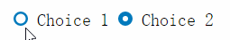
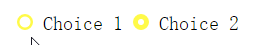
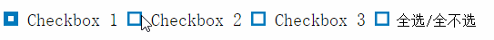

# Radio-CheckboxStyle

### Radio单选框

#### Preview



#### Usage

在`html`中嵌入如下代码

```html
<div>
	<label><span></span><input type="radio" class="radio-choice" checked="" />Choice 1</label>
	<label><span></span><input type="radio" class="radio-choice" />Choice 2</label>
</div>
```

同时在`</body>`前引入文件`awesomeicon.js`

```html
<script type="text/javascript" src="awesomeicon.js"></script>
```

如果想改变字体及选框大小、颜色，则需修改`awesomeicon.js`文件前三行变量区

```javascript
var labelHeight = 20;
var borderColor = "#0079bc";
var changeSpeed = "0.5s";
```

`labelHeight`表示字体大小(px),`borderColor`表示选框颜色,`changeSpeed`表示切换速度

### Checkbox复选框

#### Preview


#### Usage

在`html`中嵌入如下代码

```html
<div>
	<label><span></span><input type="checkbox" class="checkbox-choice" />Checkbox 1</label>
	<label><span></span><input type="checkbox" class="checkbox-choice" />Checkbox 2</label>
	<label><span></span><input type="checkbox" class="checkbox-choice" />Checkbox 3</label>
	<label><span></span><input type="checkbox" class="checkbox-choice-all" />全选/全不选</label>
</div>
```

其他步骤与Radio用法一致
